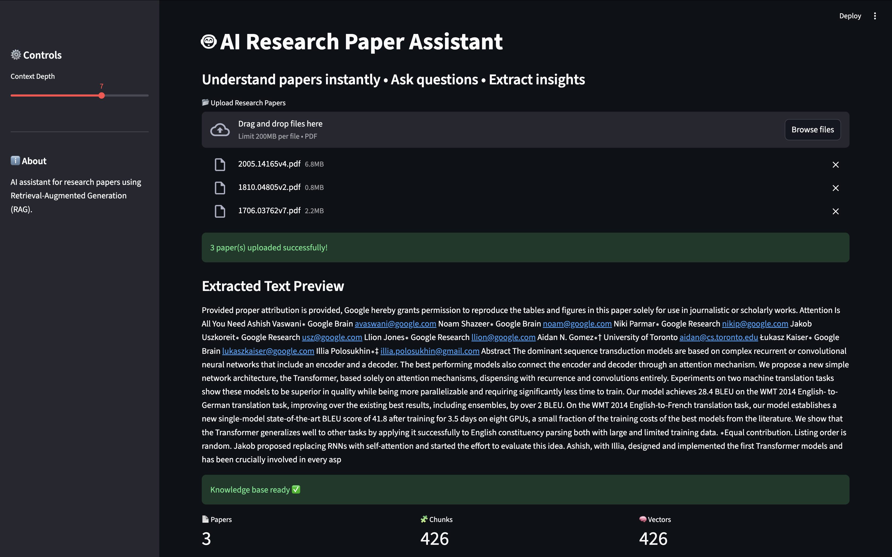

# 🤖 AI Research Paper Assistant  
### Chat with research papers • Extract insights • Generate summaries

---

## 🧠 Overview

This project implements an intelligent system for interacting with academic research papers using modern Natural Language Processing techniques.

The application allows users to upload one or more PDF research papers and perform semantic search, question answering, summarization, and insight extraction through an interactive web interface.

The system is based on a Retrieval-Augmented Generation (RAG) architecture combining vector search with transformer-based language models.

---

## 🎯 Problem Statement

Research papers are dense, lengthy, and time-consuming to analyze manually. Researchers, students, and professionals often need to quickly understand key contributions, extract relevant information, or answer specific questions.

This project aims to build an AI assistant that can:

- Understand scientific documents
- Retrieve relevant sections
- Provide grounded answers
- Summarize content
- Extract key insights

---

## ✨ Key Features

- 📂 Multi-paper upload support  
- 💬 Chat-style interface  
- 🧠 Semantic search using embeddings  
- ❓ Context-aware question answering  
- 📝 Automatic paper summarization  
- 📌 Key contribution extraction  
- 📊 Metrics dashboard  
- 🔍 Transparent context display  
- 📥 Downloadable summary  
- ⚡ Fast vector search with FAISS  

---

## 🏗️ System Architecture

PDF → Text Extraction → Chunking → Embeddings → Vector Index (FAISS)  
→ Semantic Retrieval → Transformer QA & Summarization → Dashboard  

---

## 🧠 Technologies Used

**Programming & Frameworks**

- Python 3.10+
- Streamlit

**Machine Learning & NLP**

- Sentence Transformers
- HuggingFace Transformers
- T5-Small
- MiniLM SQuAD2 QA model

**Data Processing**

- PyMuPDF
- NumPy

**Vector Search**

- FAISS

---

## 📂 Input

The system works with arbitrary research papers in PDF format, including IEEE, ArXiv, and technical reports.

---

## 🧩 Methodology

1. Extract text from PDFs  
2. Split into overlapping chunks  
3. Convert text into embeddings  
4. Store embeddings in FAISS index  
5. Retrieve relevant chunks  
6. Apply QA model  
7. Generate summaries and insights  

---

## 💻 User Interface

---

## ▶️ How to Run

### 1️⃣ Clone the Repository

git clone https://github.com/your-username/research-paper-assistant.git  
cd research-paper-assistant  

---

### 2️⃣ Create Environment

conda create -n paper-assistant python=3.10  
conda activate paper-assistant  

---

### 3️⃣ Install Dependencies

pip install -r requirements.txt  

---

### 4️⃣ Launch Application

streamlit run app/app.py  

---

## ⚙️ Requirements

See requirements.txt for full dependency list.

---

## 🧪 Use Cases

- Literature review assistance  
- Academic research support  
- Technical document analysis  
- Knowledge extraction  

---

## ⚠️ Challenges Faced

- Handling long documents beyond model limits  
- Ensuring stable performance on Apple Silicon  
- Efficient chunking strategy  
- Maintaining retrieval accuracy  

---

## 🚀 Future Work

- Citation extraction  
- Section-aware summarization  
- Persistent vector database  
- Cloud deployment  
- Support for larger models  

---

## 👨‍💻 Author Contribution

This project was independently designed and implemented as an end-to-end AI system.

Contributions include:

- System architecture design  
- Data processing pipeline  
- Embedding-based retrieval system  
- Transformer integration  
- Dashboard development  
- Performance optimization  

---

## 📜 License

For academic and educational use only.